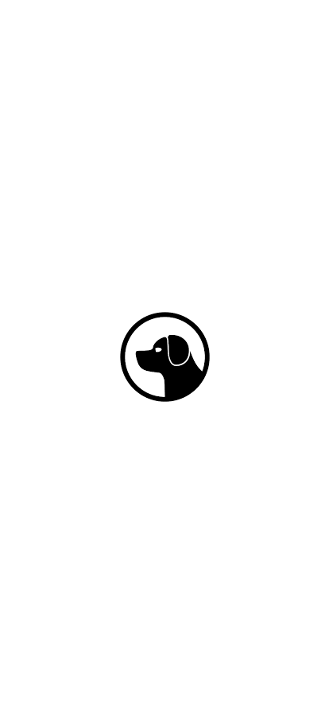
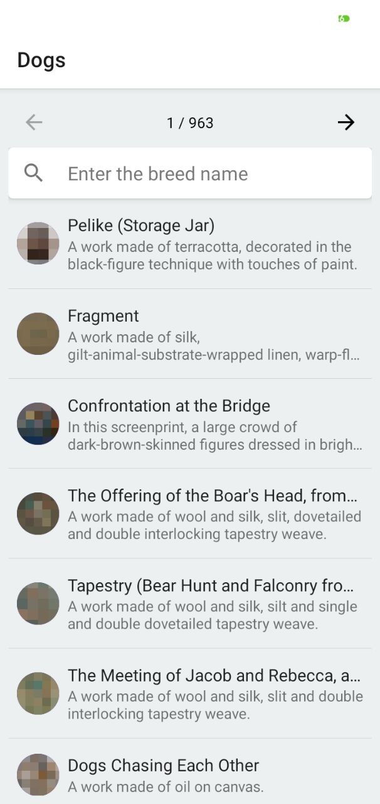
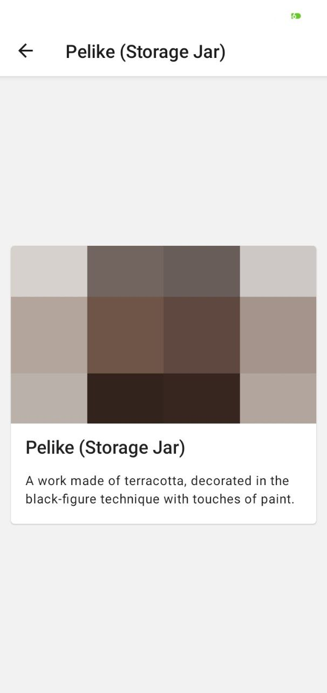

# DogApp

React Native Dog App to list all the dog breeds

## Setup

### Install the dependencies

```shell
# yarn
yarn install

# npm
npm install
```

### Install pods

```
pod install
```

### Run the metro bundler

```
yarn start
```

### Run the application on the device

```shell
# android
yarn android

# ios
yarn ios

# web
yarn web
```

## Dependencies

- react-navigation 5

Navigation library

- react-native-paper

component library

- redux-toolkit

State management library for react. 

## Screens

### Splash Screen

The splash screen is created using figma design tool



## Home Screen

Contains a list of dog images and a search bar to filter the dog images.

At the top previous and next button will paginate between the pages of the list. Each page contains 10 items.

**Note**:
The image of the list is not working as the api does not return proper image from the server



## Details Screen

Contains details of a image of the dog

**Note**:
The image of the list is not working as the api does not return proper image from the server



## TODO

1. Writing test cases

https://redux.js.org/usage/writing-tests

2. Adding additional views
